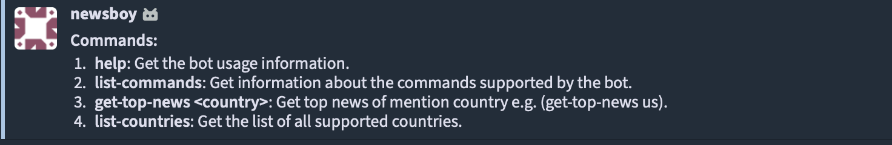
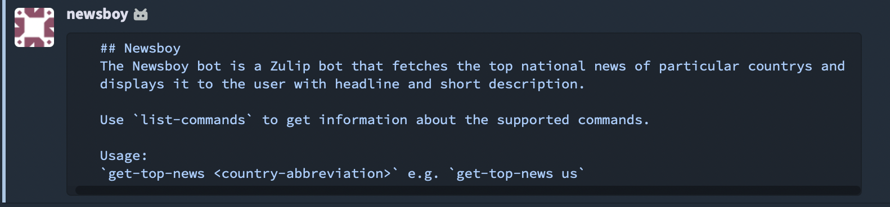

# Newsboy

The Newsboy bot is a Zulip bot that fetches the top national news of particular country and sends them to the user.

To use the Newsboy bot, you can simply call it with `@<botname>` followed
by a command, like so:

```
@Newsboy help
```

## Setup

Before usage, you will need to configure the bot by putting the value of the `<api_key>` in the config file.
To do this, follow the given steps:

1. Go to [this]( https://newsdata.io/api-key) link after logging in at [newsdata.io]( https://newsdata.io).
2. Continue to get your `api_key`.
3. Open up `zulip_bots/bots/newsboy/newsboy.conf` in an editor and change the value of the `<api_key>` attributes to the corresponding noted values.

## Developer Notes

Be sure to add the additional commands and their descriptions to the `supported_commands`
list in `newsboy.py` so that they can be displayed with the other available commands using
`@<botname> list-commands`. Also modify the `test_list_commands_command` in
`test_newsboy.py`.

## Usage

`@newsboy list-commands` - This command gives a list of all available commands along with
short descriptions.

Example:
 **`list-commands`**



 **`@bot_name help`**



 **`get-top-news <country>`**
 

