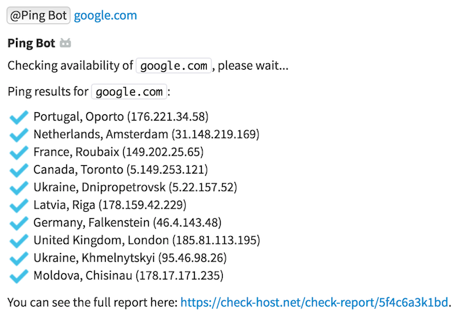
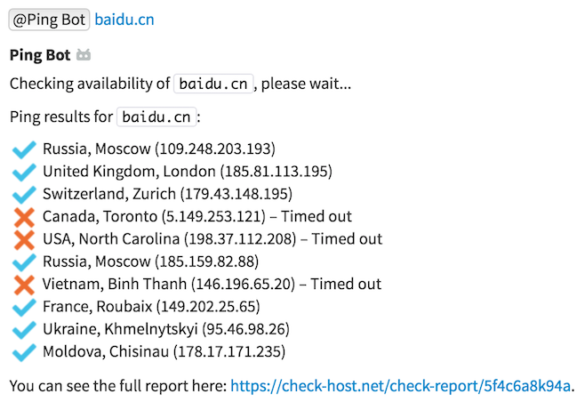

# Ping Bot

This bot allows users to check availability of a given hostname or IP
address across 10 random locations.

## Setup

This bot does not require any special setup. Just run it according to the
instructions in
[this guide](https://zulipchat.com/api/running-bots#running-a-bot).

## Usage

